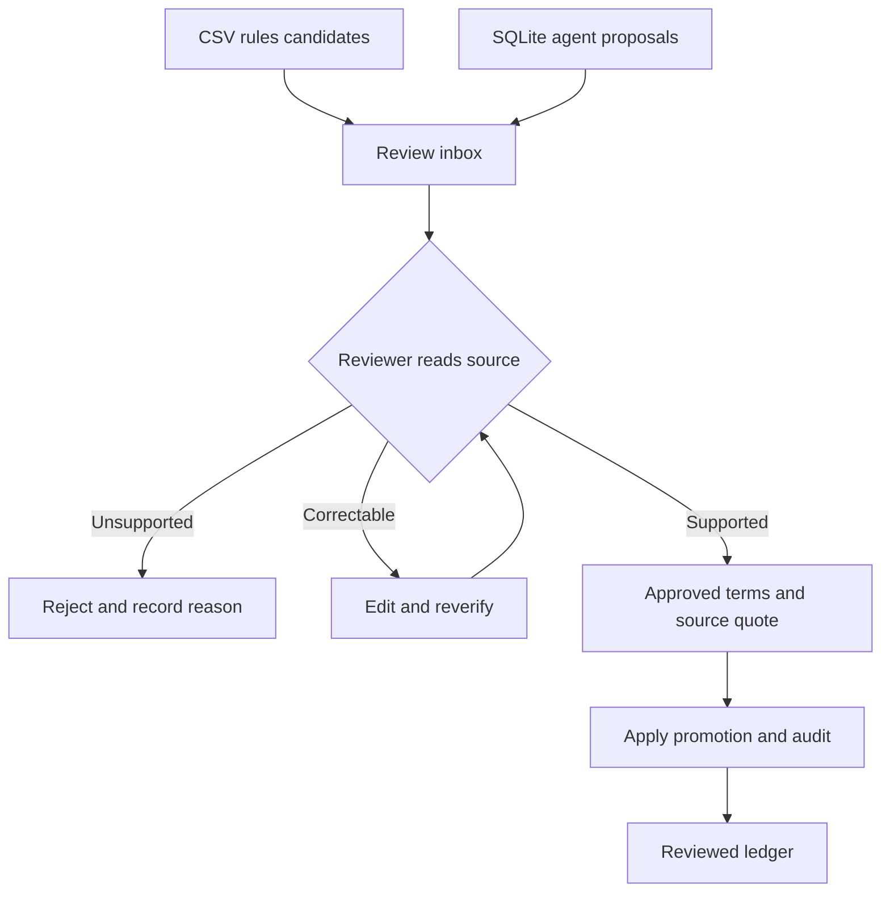

# Data and ledger

## Review and promotion

```mermaid
flowchart TD
    R["CSV rules candidates"] --> I["Review inbox"]
    A["SQLite agent proposals"] --> I
    I --> H{"Reviewer reads source"}
    H -->|Unsupported| X["Reject and record reason"]
    H -->|Correctable| E["Edit and reverify"]
    E --> H
    H -->|Supported| P["Approved terms and source quote"]
    P --> B["Apply promotion and audit"]
    B --> L["Reviewed ledger"]
```
