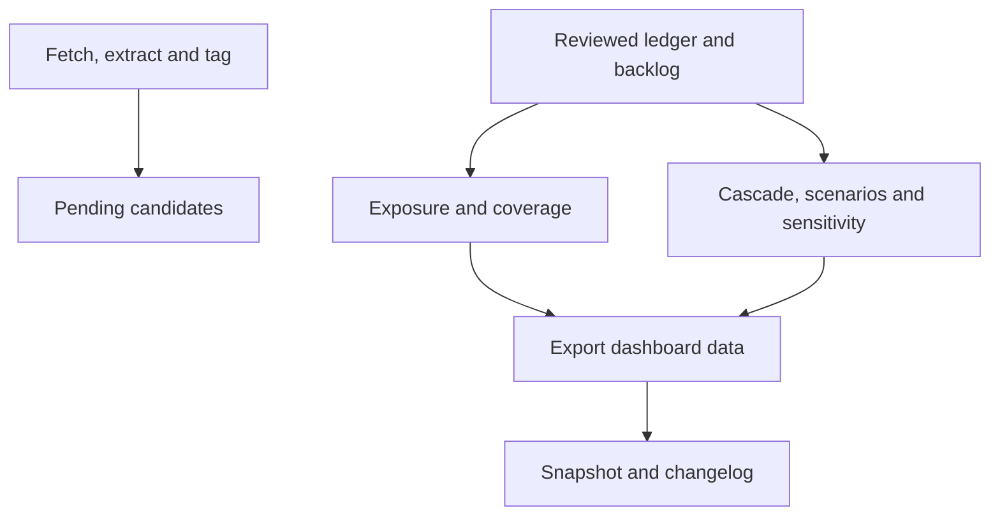

# Metrics and stress

## Refresh and stress

```mermaid
flowchart TD
    S["Fetch, extract and tag"] --> C["Pending candidates"]
    L["Reviewed ledger and backlog"] --> M["Exposure and coverage"]
    L --> T["Cascade, scenarios and sensitivity"]
    M --> E["Export dashboard data"]
    T --> E
    E --> H["Snapshot and changelog"]
```
