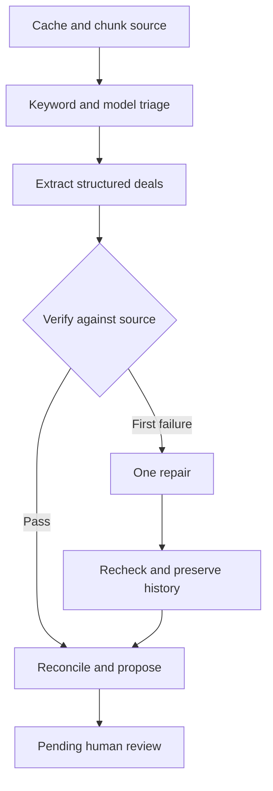

# Deal agent

## Proposal workflow

```mermaid
flowchart TD
    S["Cache and chunk source"] --> T["Keyword and model triage"]
    T --> X["Extract structured deals"]
    X --> V{"Verify against source"}
    V -->|First failure| R["One repair"]
    R --> C["Recheck and preserve history"]
    V -->|Pass| Q["Reconcile and propose"]
    C --> Q
    Q --> H["Pending human review"]
```
