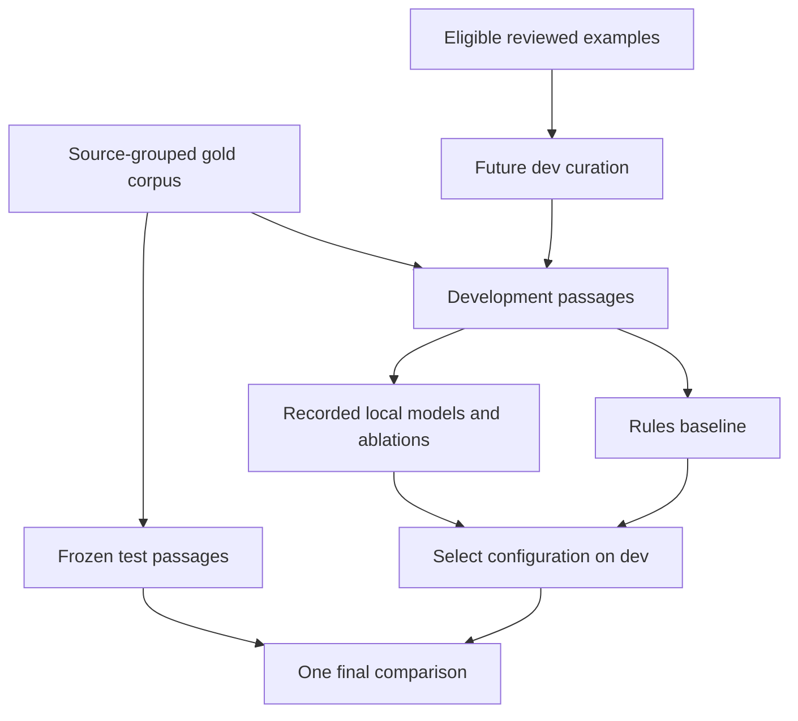

# Evaluation

## How an experiment runs

```mermaid
flowchart TD
    G["Source-grouped gold corpus"] --> D["Development passages"]
    G --> T["Frozen test passages"]
    D --> R["Rules baseline"]
    D --> A["Recorded local models and ablations"]
    R --> S["Select configuration on dev"]
    A --> S
    S --> F["One final comparison"]
    T --> F
    H["Eligible reviewed examples"] --> N["Future dev curation"]
    N --> D
```
